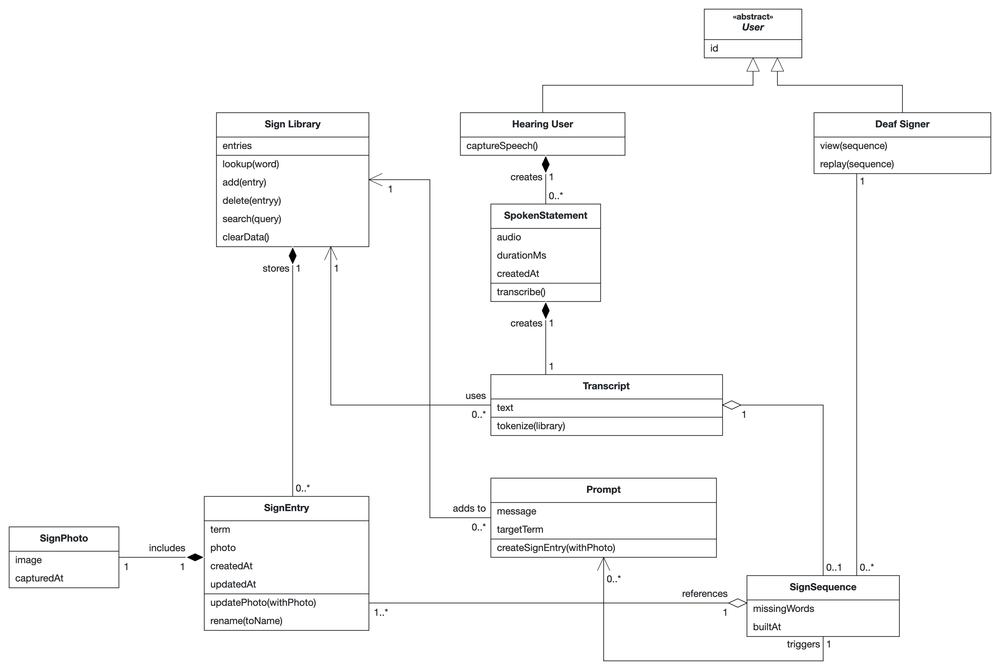
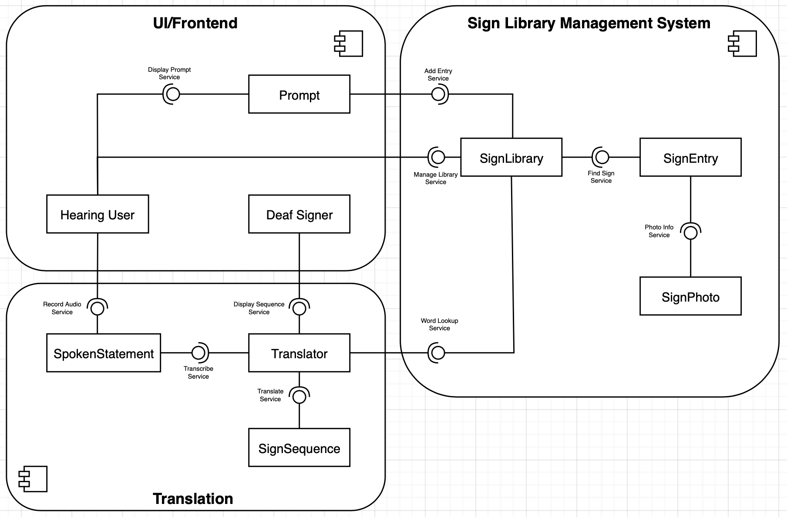

# Papaya - Spoken-to-Sign Language Translator

Hi there, I'm Nico 👋
I'm a current master student in Computer Science at TUM.  
During the seven-day Swift preliminary course, which was part of the university course “iPraktikum (IN0012),” we were tasked with developing an iOS app and then presenting it before the course ended. Out of 56 projects submitted, my app came in second place.

  

## Project Documentation

Papaya is a spoken-to-sign language translation app that bridges communication between hearing and deaf users.
It listens to short spoken phrases, matches each word to a video clip of the corresponding sign from a local sign library, and plays the sequence with smooth, cross-fading transitions.
Users can add missing sign entries by capturing their own videos, building a personalized sign library over time.

### Problem Statement

Millions of deaf signers rely on sign languages for natural, fluent communication. In day-to-day interactions at offices, clinics, universities, and public transit, spontaneous access to human interpreters is rare, while text chat and lip-reading are slow, inaccurate, or cognitively demanding. Hearing people often don't know even basic signs, which turns simple, time-critical exchanges into frustrating experiences and social exclusion.

Papaya addresses this gap by translating short spoken statements into a transcript, matching each word to a sign entry in a sign library, and presenting an ordered sign sequence with smooth transitions. The primary users are deaf signers who need fast comprehension of what a hearing person just said. Secondary users include hearing users, staff, educators, and family members who want to communicate respectfully without waiting for an interpreter.

Solving this matters, because accessible communication is a prerequisite for autonomy, safety, and equal participation. Papaya keeps audio and sign videos local by default and offers clear data to remove all stored content with one tap.

### Requirements

#### Functional Requirements (User Stories)

1. **Real-time speech capture**  
As a hearing user, I want to capture speech (press-and-hold) so that the deaf signer can see the sign sequence right after I finish.

2. **Word lookup & sequence assembly**  
As a Deaf signer, I want each spoken word in the transcript matched to a sign entry so that a whole sign sequence plays in order.

3. **Smooth transitions**  
As a Deaf signer, I want smooth, cross-fading transitions between consecutive sign videos so that the sequence is easy to follow.

4. **Missing word detection & prompt**  
As a user, I want the app to detect missing words and prompt to add an entry so that the sequence can still be completed.

5. **Add sign entry**  
As a user, I want to capture a video of a sign and save the entry so the new sign is available immediately.

6. **Playback controls**  
As a Deaf signer, I want play/pause, previous/next sign video, replay, and change playback speed so I can review unclear parts.

7. **Sign library management**  
As a user, I want to search, edit, and delete sign entries so that I can keep the sign library clean.

8. **Privacy & local storage**  
As a privacy-conscious user, I want my audio and sign videos stored locally by default with a one-tap clear data action so my content stays private.

9. **Clear error guidance**  
As a user, I want helpful error messages when permissions are denied or other issues occur so I know how to fix them.

#### Quality Attributes & External Constraints

- **Usability (Apple HIG)**  
The app adheres to Apple's Human Interface Guidelines by using standard components like NavigationStack, .searchable, and .toolbar. The layout adapts to both Light and Dark Modes and uses SF Symbols for consistent iconography. For example, the SignLibraryContainerView uses a standard layout toggle and search bar for a familiar user experience. [Link to SignLibraryContainerView.swift]

- **Dark Mode Support**  
The UI is fully compatible with Dark Mode. This is achieved by using semantic system colors (e.g., Color(.secondarySystemBackground)) and custom, adaptive colors defined in the Asset Catalog (e.g., Color.papayaOrange). This ensures high contrast and readability in all appearances. [Link to Assets.xcassets]

- **Responsiveness**  
The app is designed to be responsive, particularly in the video capture screen, which adapts its layout for both portrait and landscape orientations. This is managed in VideoCaptureContainerView by observing the @Environment(\.verticalSizeClass) to switch between HStack and VStack layouts, providing an optimal experience on rotation. [Link to VideoCaptureContainerView.swift]

- **Persistence**  
All user-generated sign entries are persisted locally using Apple's SwiftData framework. The SignWord model is decorated with the @Model macro, and its video files are efficiently stored in the app's Documents directory, with only the file name referenced in the database to maintain performance. [Link to SignWord.swift]

- **Logging & Error Handling**  
Significant events, state changes, and errors are logged using Apple's unified Logger framework. This provides crucial diagnostic information during development and debugging. Error states, such as permission denial, are handled gracefully by presenting informative views like ContentUnavailableView that guide the user to a solution. 

- **AI usage**  
Generative AI was used to improve the UI layout and to refactor complex code, such as the Levenshtein distance algorithm. All AI-generated code was manually reviewed, tested, and adapted to fit the project's architecture and coding standards.

#### Glossary (Abbott’s Technique)

| Terms    | Definition      |
| ------------- | ------------- | 
| User | Any person using Papaya. Is either a hearing user or a deaf signer |
| Hearing User | Person who speaks into Papaya. Creates a spoken statement. | 
| Deaf Signer | A deaf or hard-of-hearing person who reads the sign sequence. |
| Spoken Statement | A short, recorded segment of speech recorded by the hearing user. Becomes a transcript. | 
| Transcript | The text produced from the spoken statement. Used to build a sign sequence from the sign librry and may reveal missing signs. |
| Sign Video | A short video clip showing a sign. Included in a sign entry and displayed within a sign sequence. |
| Sign Entry | A stored word-sign pair, including a sign video, kept in the sign library. | 
| Sign Library | Collection of sign entries on the device. Supplies entries to build sign sequence and accepts new sign entries. |
| Sign Sequence | An ordered sequence of sign videos with cross-fade transitions. Built from a transcript via the sign library. | 
| Missing Word | Word in the transcript without a matching sign entry. Triggers a prompt to add one. | 
| Prompt | A message asking to add a sign. Leads to capturing a sign video to create a sign entry. | 

#### Analysis Object Model

### Architecture

#### Subsystem Decomposition

* UI/Frontend — Everything the user can view and interact with.
* Translation — The logic for transcribing speech-to-text and translating the text to sign language.
* Sign Library Management System - Responsible for storing and retrieving sign entries for the translating, which can be accessed and updated by the user.

